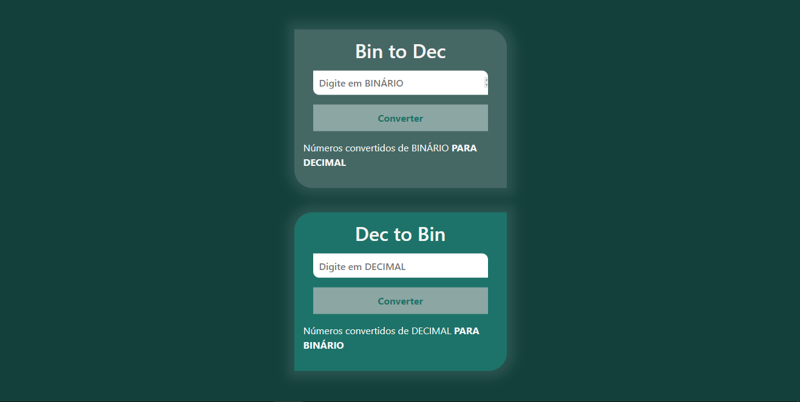

<h1 align="center">CONVERSOR</h1>

## SOBRE
Conversor de número binário para decimal e decimal para binário. Simples e objetivo.

## Bin to Dec
Para fazer converter binario em decimal utilizei o parseInt, que aprendi a usar(um pouco) com o Gustavo Guanabara. 

parseInt analisa um argumento string e retorna um numero inteiro no radix.

## Dec to Bin
E mais simples ainda foi fazer o conversor de decimal para binário. Simplesmente fiz a mesma coisa que o anterior, porém ao invés de utilizar .parseInt, utilizei o .toString.

toString retorna uma string no objeto que ta "chamando".

  

    <a href="https://felilpz.github.io/bin2Dec/"><h1>CONVERSOR</h1></a>

